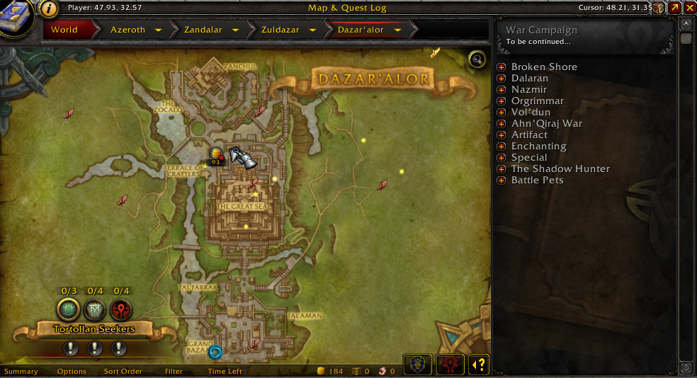
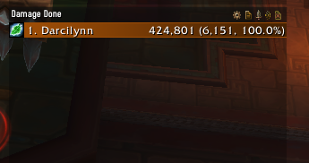
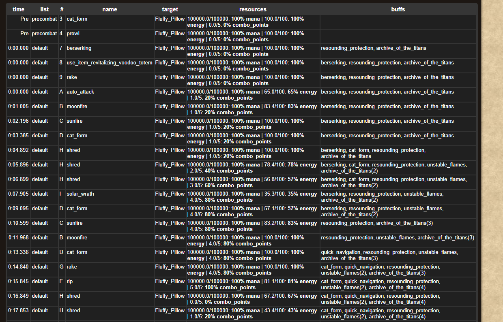
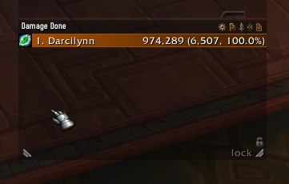
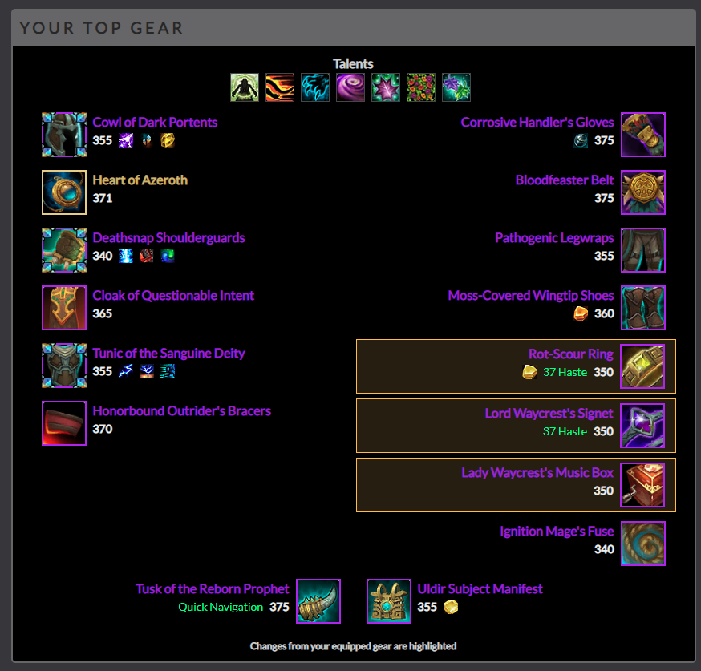
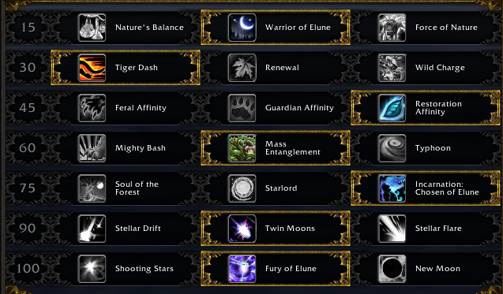

# Sims

You can take your current gear and talents and run it through various tools to figure out your theoretical upper limit for dps.

There are various tools for this, but the most popular and most used is [RaidBots](https://www.raidbots.com/simbot).

## Training Dummy

First, lets start by going to a training dummy and getting a baseline DPS.

It looks like im currently holding around 6k dps.

## Simming your current gear

* [Install simulation craft.](https://www.curseforge.com/wow/addons/simulationcraft) While it is possible to use the RaidBots Quick Sim feature without simulation craft, pulling from the Armor may not be the most up to date data.
* In game type `/simc` and copy the text from the addon.
* Go back to [Quick Sim](https://www.raidbots.com/simbot/quick) and paste the text you copied into the "Load from simc addon"
* For the time being, leave the default settings and hit the big green "Run Quick Sim" button.
* Now sit and wait for this thing to run.

https://www.raidbots.com/simbot/report/dMbrv9iASW6X8g2g7RtCpo

So, as a resto druid, I should be able to do about 8k dps with my gear and talents.

Note: RaidBots sims DPS. Even for tanks and healers. This may not be the most useful number for tanks and healers who often care more about survivability and healing done. There are other ways to work that out, but for now we're going to focus on DPS simming. Even as a tank and healer, your DPS isn't inconsequential. Your extra DPS could mean the difference between a kill and a 1% wipe.

You can also take a look at the [full report](https://www.raidbots.com/simbot/report/dMbrv9iASW6X8g2g7RtCpo/simc) for a more detailed look at how to get here. There is an INSANE amount of information in the full report. You can look at charts showing what skill did the most damage or what the sim spent the most time casting.

This table shows a sample cast sequence.

Based on all this info, you can find out how you should be dpsing! Head over to a training dummy.

Just adjusting my rotation I can add an extra .5k dps. With some practice I should get closer to that 7.9k!

## Best in Bag

We can use [top gear](https://www.raidbots.com/simbot/topgear) to find the best gear in our bags.

As a [benchmark](https://www.raidbots.com/simbot/report/nuacSps2Saz1GC7HRyERJ3)I put on some random rings and trinkets. With this random set of gear I sim at 8,689 dps.

I don't have premium, so I'm limited to 300k iterations. The more gear you want to compare, the more iterations it will take. So for now, im going to lock in my 'Lady Waycrest's music box' and compare 3 trinkets and 3 rings for the other slots. The [end result](https://www.raidbots.com/simbot/report/3YLf5q8kHS75CnCKUFuuBo) is that i should use rot-scour ring, 'Lord Waycrests signet' and 'Ignition Mage's Fuse'. This puts me at 9156 dps.

Now im going to equip those, and then re-sim with the Fuse locked, but the music box unlocked. [Turn's Out](https://www.raidbots.com/simbot/report/oYLp9Ea6MZQJFj7Ay4Q6Nw) this is the best combo for me! If I wanted to, I could keep manually doing this process, iterating over other gear sets.

## Top Talents

You can also use RaidBots to help sim your [talents](https://www.raidbots.com/simbot/talents). Currently, on my moonkin, I have the following traits equipped

If we use the talent compare tool, we can determine if should use 'Chosen of Eluen' or 'Starlord'. The [report](https://www.raidbots.com/simbot/report/fjz5GqB3fcGCBGo5CHjwZ3) shows that Starlord is slightly better in comparison.

If you're curious, resto druids do about [30% less dps](https://www.raidbots.com/simbot/report/8aX5ffGZbzod2317Krg3T) when taking balance or guardian affinity over feral affinity.