# Warcraft Logs

> “But my parrrrrsseeeeeeeee” --The memes

If you’ve joined on any raids or listened in on our raid discussions, you’ve heard about parses and Warcraft logs. This is a core part of how people judge themselves and others and a good metric for how well you are progressing.

Wait. Slow down. Backup. What in the WORLD is a “parse” and what in the world does it have to do with a players abilities?

Well, lets start by talking about how Warcraft logs works and what it keeps track of.

## Reports

During raids, one of our officers or core members will combat log the fight. This tracks a lot of information about the fight, including spells cast, damage done, damage taken, position, and more! These reports are then uploaded to Warcraft logs which organizes and displays the reports in a human readable manner. You can find all of our [guilds reports here](https://www.warcraftlogs.com/guild/reports-list/199523/).

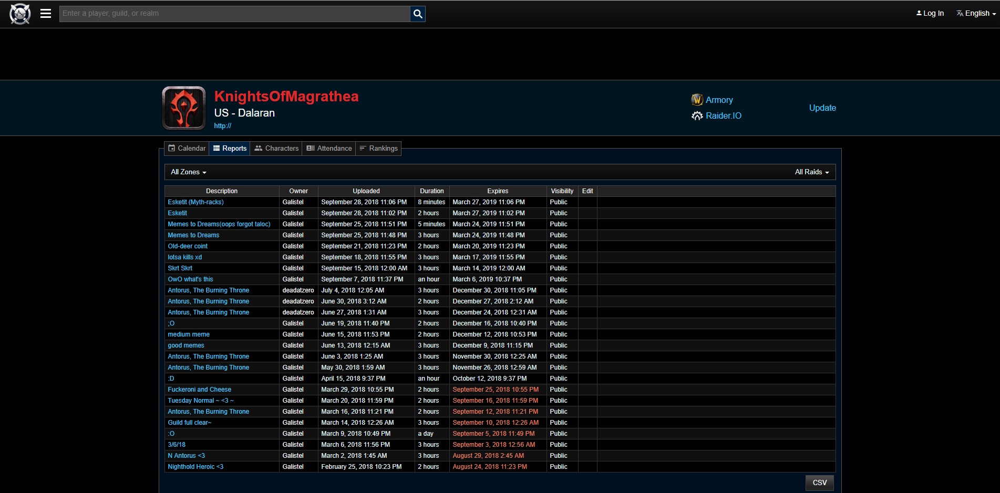

Lets dig into September 25ths reports “Memes to Dreams”. Specifically, lets look at our [Zek’Voz kill](https://www.warcraftlogs.com/reports/tDvxKpm7n6aGyNgJ#fight=8).

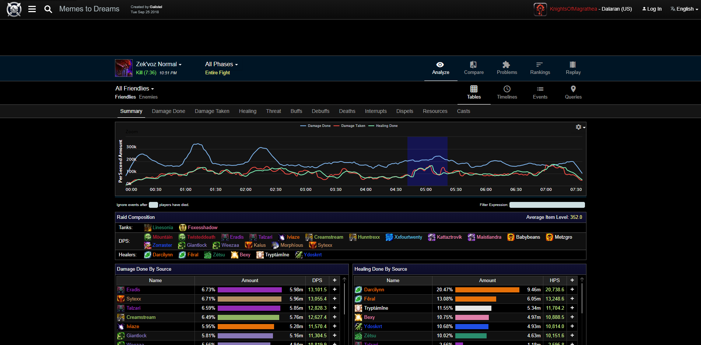

There is an incredible amount of detail on this page. It certainly is information overload! Don’t be overwhelmed, we can take this piece by piece.

### Summary

In summary tab you can see a cool little graph of the raids overall per-second stats for damage done, damage taken, and healing done. This is pretty, but generally useless information. The most useful information you can get from this graph is making sure that heals are going out at appropriate times. The damage taken and healing done charts should have spikes at roughly the same times. If we don’t see spikes at the same time, healers are putting healing resources out at the wrong times.

If you look further down the page, you can see the “Damage Done By Source” and “Healing Done By Source” sections. These sections are what people most frequently come to Warcraft logs for. You can click on the “Damage Done” and “Healing Done” tabs at the top for more detailed tables. Lets click into the [“Healing Done” section](https://www.warcraftlogs.com/reports/tDvxKpm7n6aGyNgJ#fight=8&type=healing) and get a better look at these stats.

### Damage / Healing Done

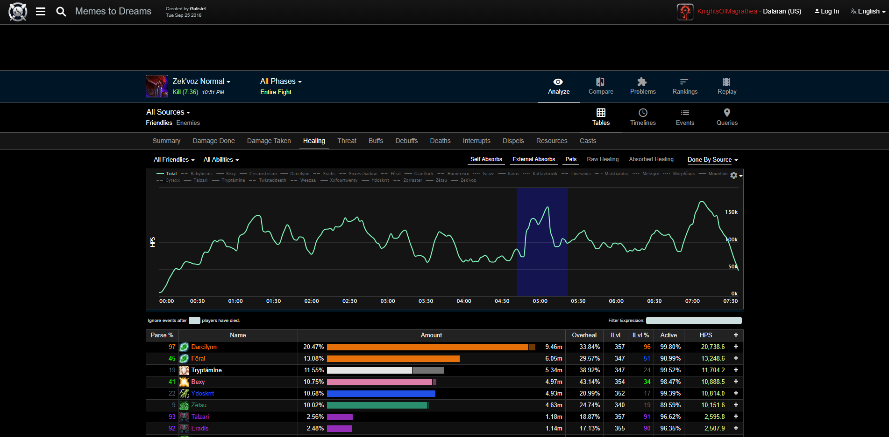

This is where you can see your “parse” number. A parse is simply a [percentile rank](https://en.wikipedia.org/wiki/Percentile_rank) for the HPS or DPS you did for that fight. In other words, in this Zek’voz kill, Darcilynn healed `20,738.6`. Of all Zek’voz kills on record, that `20,738` is in better than 97% of other resto druids heals per seconds and better than 96% of resto druids of the same ilvl.

This is usually where most people stop. Knowing where you fall on the bell curve and trying to get that number up is an admirable goal, but really the question becomes HOW do we get this number up. Luckily, Warcraft logs gives much much deeper details than just this number. Lets dig into [Darcilynn’s report](https://www.warcraftlogs.com/reports/tDvxKpm7n6aGyNgJ#fight=8&type=healing&source=23) on this fight.

#### Individual breakdown

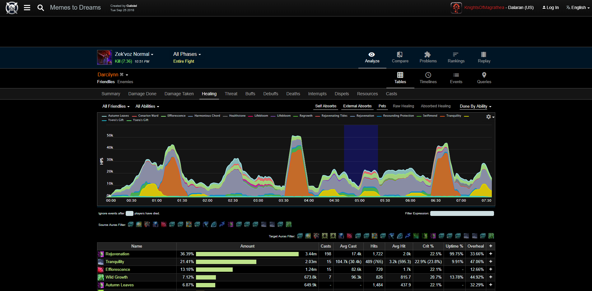

This page gives slightly more useful stats than the overview. We can see here how much each heal does on average, how often each heal procs (which is especially useful for determining if certain traits are good), the uptime for each spell, and how much each spell overhealed.

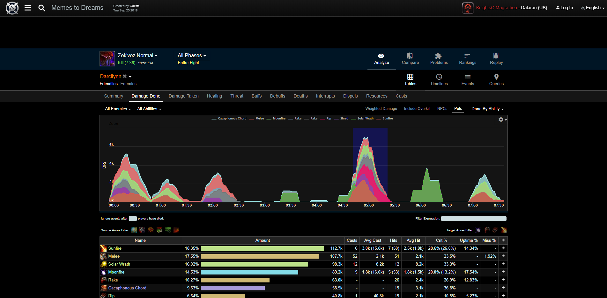

Similarly, on damaged done, you can see uptime and miss% stats. This info is interesting, but not the most useful on its own.

#### Comparison

On the top, there are 5 buttons: Analyze, Compare, Problems, Rankings, Replay. If we swap over to the “Compare” tab, we can find other players to compare to and see what we can do better.

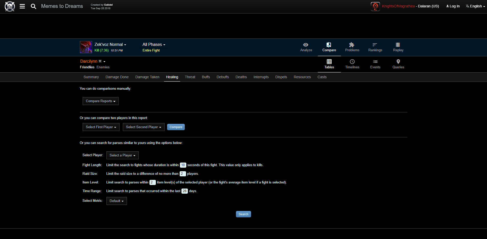

To compare, we first need another report to compare to. If you know of someone you want to compare to, you can compare their report manually.

Alternatively, you can search for others similar to you right in this page!

The default settings for the search are fairly okay, but you may want to relax the fight length / raid size if you have difficulty finding good parses with these settings. So lets select “Darcilynn” in the player drop down and see what parses we find.

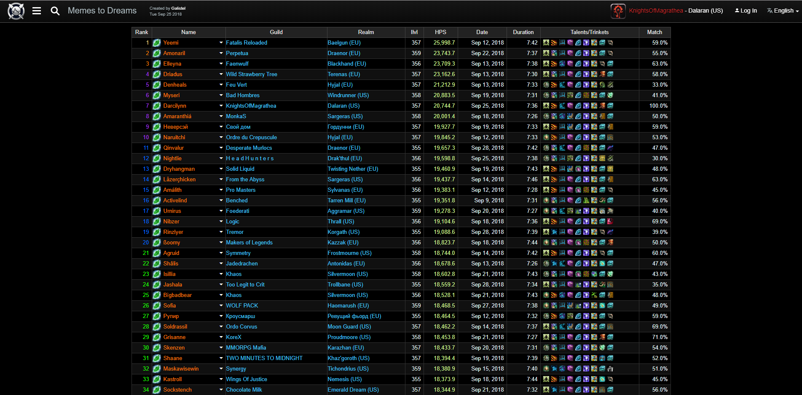

There are a few healers in these constraints who healed 3-5k more than Darcilynn! Lets compare to the [top in the group, Yeemi.](https://www.warcraftlogs.com/reports/compare/tDvxKpm7n6aGyNgJ/tN7gkXhqCf4Kn9dG#fight=8,20&source=23,Yeemi&type=healing)

Starting with the summary page again

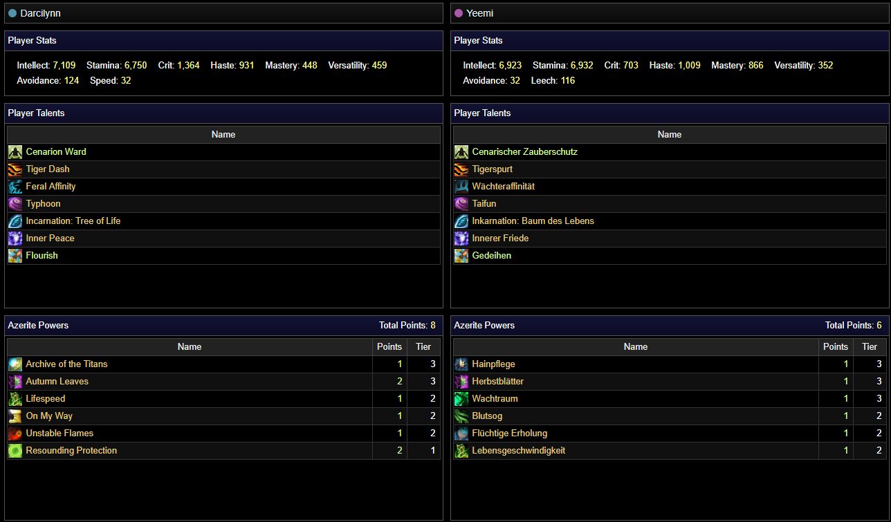

We can see that the stat priorities here are a little different here. Yeemi brought slightly less Int and haste, and much less crit, but significantly more mastery and leech.

As for talents, there isn’t a huge difference. One brought feral affinity for dps, one brought guardian affinity for reduced damage taken.

Azerite powers could be another large source of difference. Darcilynn has 2 stacks of autumn leaves and 1 archive of the titans. Perhaps experimenting with the “waking dream” azerite trait could help. Yeemi’s “Ysera’s Gift” healed nearly twice as much as Darcilynns. 

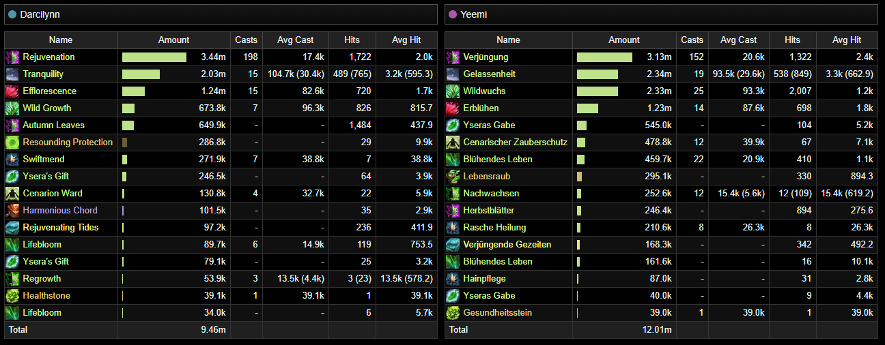

We can also see here that Darcilynn cast a lot more `Rejuvenation` (46 more casts) and had less hits on wild growth (18 fewer). This may be an indication that Darcilynn should be using wildgrowth more often for more effective heals. There are other, more subtle, differences here as well. Taking time to analyze different choices in spells cast could reveal what Yeemi did better than Darcilynn. It is also likely useful to compare to resto druids, as a whole.

### Top Traits and Talents

We can use [the rankings page](https://www.warcraftlogs.com/zone/rankings/19) to search for the players with the best parses in any category. In this case, lets try to find the player healing rankings for zek’voz normal, in all regions, for all resto druids, for all item levels.

This is interesting information. Top resto druids on this fight are healing upwards of 27k. Their fights often last under 4 minutes. The most used Talents are Cenarion Ward, Tiger Dash, Guardian Affinity, Typhoon, Tree of life, Inner Peace, and Flourish. The most used trinkets are Darkmoon Deck Tides and Conch of Dark Whispers. The most used Azerite powers are Autumn leaves, wound binder, and resounding protection. While this is interesting knowledge, we really want to see what the TOP resto duids do. For this, lets swap over to the [statistics view.](https://www.warcraftlogs.com/zone/statistics/19/#metric=hps&boss=2136&difficulty=3&class=Druid&spec=Restoration&combatantinfo=Azerite&dataset=90&tier=3)

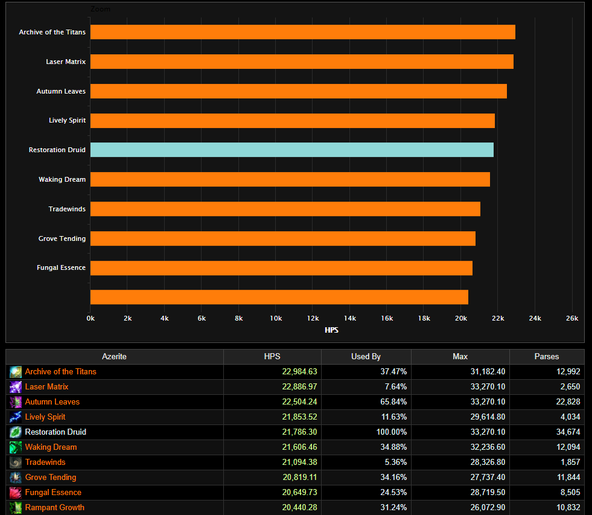

I filtered down to azerite traits used by those in the 99th percentile for Resto druids on normal Zek’Voz. We can see here, the highest healing traits are archive of the titans, lazer matrix, and autumn leaves.

You can do similar searches for trinkets and talents. With all this knowledge combined, perhaps Darcilynn should put less focus on Autumn leaves, and use Archive of the Titans and Laser matrix and put more of a focus on casting Wild Growths over Rejuvenations.

### Improving Raid Mechanics

Damage done and Healing done are the most straight forward numbers to improve on but that isn’t all that is necessary for improving in raids. If you don’t correctly execute raid mechanics, it doesn’t matter how hard you hit or heal, you’ll get the raid wiped.

Using warcraft logs to determine if you’re messing up raid mechanics is much less straight forward than just figuring out how to improve your DPS/HPS numbers, but it CAN be done. We’re going follow Darcilynn through a few different fights and look at how they preform on raid mechanics.

#### Damage taken and Debuffs

One of the most obvious signs of messing up raid mechanics is taking too much damage or too many debuffs. Lets look at [Darcylinn’s debuffs on Vectis](https://www.warcraftlogs.com/reports/tDvxKpm7n6aGyNgJ#fight=7&type=auras&source=23&spells=debuffs).

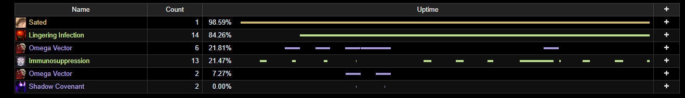

In Vectis, messing up raid mechanics will apply extra stacks of `Lingering Infection`. We want to minimize the number of stacks of this debuff, but Darcilynn got 14!

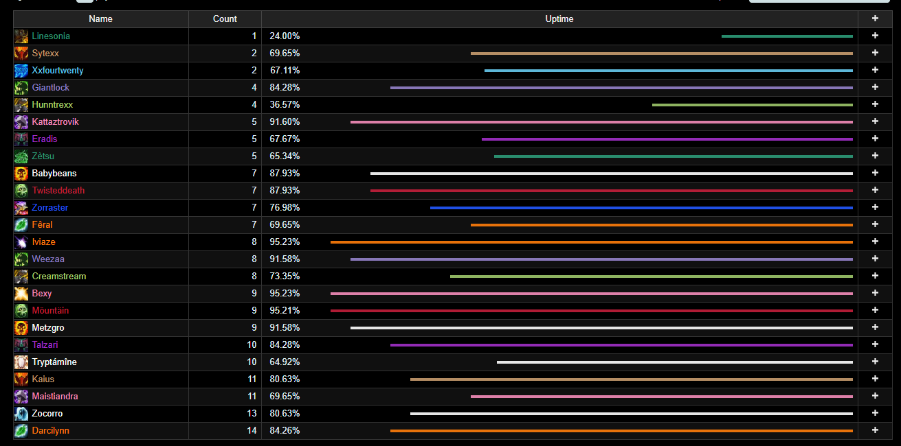

If we look at the [raid as a whole](https://www.warcraftlogs.com/reports/tDvxKpm7n6aGyNgJ#fight=7&type=auras&spells=debuffs&ability=265127) Darcilynn took the most number of stacks, while some players managed to take only 1. This is certainly room for improvement.

In a more complicated fight, like Mythrax, we may have to look at the number of times someone gets hit by a particular skill. In Mythrax, players really need to avoid taking `Obliteration blast` and `obliteration beam` to the face. [Darcilynn](https://www.warcraftlogs.com/reports/tDvxKpm7n6aGyNgJ#fight=last&type=damage-taken&source=23) appears to have managed to avoild the blast, but has 11 hits from the beam (meaning he probably ate the entirety of a beam). 

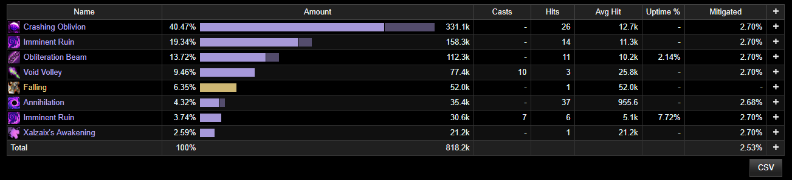

While this isn’t a mechanic that results in the immediate death of other raid members, losing a player puts stress on the rest of the raid and just makes everyones job harder. Remember, when you die your DPS/HPS goes to 0.

#### Replay

An important part of Mythrax is positioning. You can use the [fight replay](https://www.warcraftlogs.com/reports/tDvxKpm7n6aGyNgJ#fight=last&view=replay) feature to rewatch the entire fight. This is useful for a number of things, but its especially useful for seeing how you can improve positioning.

You can see in the replay, Darcilynn, and most of the other range players, plant their feet throughout the fight, moving only slightly to avoid blasts and then repositioning again and staying still.

The melee, on the other hand, are constantly moving and repositioning. This constant movement in a fight where you MUST stay 5yards spread is incredibly taxing on other raid members. It is important to note, there is certainly enough space for the melee to stand 5 yards apart, move for mechanics, and then move back into their positions. 

#### Dispels

You can also look at dispels to glean some information about where a fight went wrong. In Zuul, you need to dispel players who are feared before they leap to their deaths. On the [first Zuul pull of the night](https://www.warcraftlogs.com/reports/tDvxKpm7n6aGyNgJ#fight=9&type=dispels). Most of the dispels were handled by Babybeans.

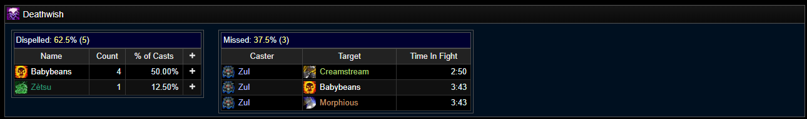

That’s a lot of stress to put on a DPS who should be focused on, well, dpsing. This pull resulted in a wipe. [Our next pull though](https://www.warcraftlogs.com/reports/tDvxKpm7n6aGyNgJ#fight=10&type=dispels) was a success!

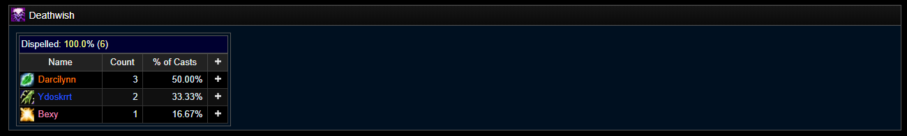

The healers properly pitched in on this, leaving the DPS to keep dpsing.